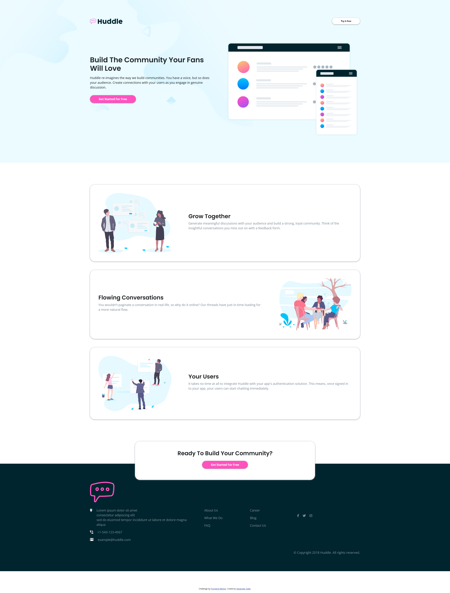

# Frontend Mentor - Huddle landing page with alternating feature blocks solution

This is a solution to the [Huddle landing page with alternating feature blocks challenge on Frontend Mentor](https://www.frontendmentor.io/challenges/huddle-landing-page-with-alternating-feature-blocks-5ca5f5981e82137ec91a5100). Frontend Mentor challenges help you improve your coding skills by building realistic projects. 

## Table of contents

- [Overview](#overview)
  - [The challenge](#the-challenge)
  - [Screenshot](#screenshot)
  - [Links](#links)
- [My process](#my-process)
  - [Built with](#built-with)
  - [What I learned](#what-i-learned)
  - [Continued development](#continued-development)
  - [Useful resources](#useful-resources)
- [Author](#author)
- [Acknowledgments](#acknowledgments)

## Overview

### The challenge

Users should be able to:

- View the optimal layout for the site depending on their device's screen size
- See hover states for all interactive elements on the page

### Screenshot

### Links

- Solution URL: https://your-solution-url.com
- Live Site URL: https://your-live-site-url.com

## My process

### Built with

- Semantic HTML5 markup
- CSS custom properties
- Bootstrap

### What I learned

- Using Bootstrap to layout an style elements
- using media queries to change the layout depending on screen-sizes
- using z-index to overlap elements

### Continued development

- get more routine in buidling elements and webpages
- keepthe css-code more readable
- media queries

### Useful resources

- [Bootstrap documentation](https://getbootstrap.com/docs/5.3/getting-started/introduction/)
- [z-index](https://developer.mozilla.org/en-US/docs/Web/CSS/z-index?retiredLocale=de)
- [translate] (https://developer.mozilla.org/en-US/docs/Web/CSS/transform-function/translate)

## Author

- GitHub - [Alexander Adler](https://github.com/aadler91)
- Frontend Mentor - [@aadler91](https://www.frontendmentor.io/profile/aadler91)

## Acknowledgments

This is where you can give a hat tip to anyone who helped you out on this project. Perhaps you worked in a team or got some inspiration from someone else's solution. This is the perfect place to give them some credit.
